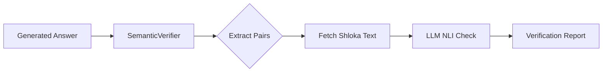

# Semantic Verification Design (Phase B+ Sprint 4)

**Objective:**
Programmatically verify that every claim in a generated answer is supported by the cited shloka text. This directly addresses the "Hallucination / Overclaiming" issue (e.g., Q4 Timeline).

**Core Logic:**
1.  **Extraction:** Identify sentences ending with citations.
    - *Example:* "Hanuman burned Lanka [Sundara 54.30]."
    - *Claim:* "Hanuman burned Lanka"
    - *Citation:* "Sundara 54.30"
2.  **Retrieval:** Fetch the *actual English translation* of the cited shloka from our DB (or from the `retrieval_results` in the trace).
3.  **Verification (NLI):** Call an LLM (Cheaper model like `gpt-4o-mini`):
    - *Prompt:* "Premise: [Shloka Text]. Hypothesis: [Claim]. Does the Premise entail the Hypothesis? Answer YES/NO."
4.  **Action:**
    - **Drafting Mode:** Highlight unsupported claims in UI (Future).
    - **Evaluation Mode:** Flag as "Semantically Unsupported" (Current).

## Architecture



## Data Structures

```typescript
interface ClaimCitationPair {
  claimText: string;
  citationId: string; // "Sundara Kanda 54.30"
  shlokaText: string;
}

interface VerificationResult {
  isSupported: boolean;
  confidence: number;
  reasoning: string;
}
```

## Implementation Steps

1.  **Regex Update:** Ensure robust extraction of `[Kanda Sarga.Shloka]` from answer string.
2.  **`SemanticVerifier` Class:** Implement `verifyClaim(claim, shlokaText)`.
3.  **Integration:**
    - Can be run *offline* (Batch Evaluator).
    - Can be run *online* (Post-generation async check).

## Cost Consideration
Running this on *every* citation for *every* query in real-time adds latency and cost.
For Phase B+, we typically run this **Asynchronously** (background job) or **On-Demand** (Evaluation Script).
We will implement it as a standalone script first: `scripts/verify_semantics.py` (or TS).

**Decision:** Implement as a Python script first to validate the Logic on the Golden Dataset.
Then port to TypeScript `SemanticVerifier` service for production usage.
