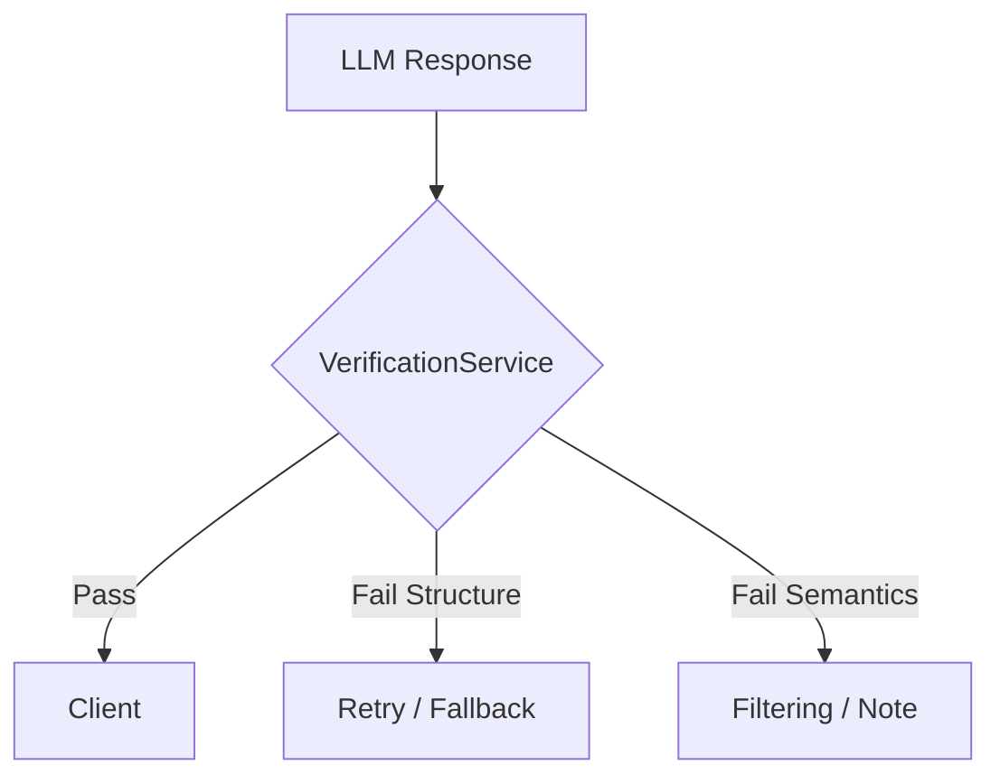

# Verification Service Design (Phase B+)

**Objective:**
Implement a robust validation layer (`VerificationService`) in the Tattva backend to enforce structural and semantic quality *before* the response reaches the user.

**Success Criteria:**
1.  **Eliminate Structural Failures:** 100% compliance with JSON schema (e.g., T2 `limitOfCertainty` presence).
2.  **Filter Unsupported Claims (Future):** Verify claim-citation alignment programmatically.

## Architecture



## 1. Structural Validation (Sprint 3)

The service will validate the JSON object against TypeScript interfaces/schemas for T1, T2, T3.

### T2 Validation Rules:
- Must have `answer`.
- Must have `traditionalInterpretations` (array or string).
- **CRITICAL:** Must have `limitOfCertainty` (string, length > 10 chars).
- Must have `whatTextStates` (string).

### T1 Validation Rules:
- Must have `answer`.
- Must include at least 1 citation (unless explicit negative assertion detected).

## 2. Semantic Validation (Sprint 4 - Future)

- **Claim Extraction:** Parse "Statement [Citation]" patterns.
- **Citation Lookup:** Retrieve text for Citation.
- **NLI Check:** Use small model (e.g. Flash) to verify Entailment.
- **Action:** If unsupported, remove citation or flag claim.

## Implementation Plan

1.  Create `lib/services/verification-service.ts`.
2.  Define `SchemaValidator` class using `zod` or manual checks.
3.  Integrate into `answer-service.ts` pipeline *after* generation *before* returning.
4.  Implement "Retry Strategy" (e.g. if T2 missing field, call LLM again with error message? Or auto-fix?).
    - *Decision:* For Phase B+, we will start with **Logging & Telemetry** only, then enable **Blocking/Retrying**.

## T2 Missing Field Auto-Fix (Heuristic)
If `limitOfCertainty` is missing but `answer` contains key phrases like "It is unclear...", extract it?
Or simply default to a generic "Interpretations are subject to scholarly debate." note if missing?
*Decision:* Default to generic note for "Limit of Certainty" to prevent UI crash/Evaluation failure.

## Code Structure

```typescript
export class VerificationService {
  static validateT2(response: any): ValidationResult {
    const errors = [];
    if (!response.limitOfCertainty) errors.push("Missing limitOfCertainty");
    // ...
    return { valid: errors.length === 0, errors };
  }

  static fixT2(response: any): any {
    if (!response.limitOfCertainty) {
      response.limitOfCertainty = "The provided text allows for multiple interpretations...";
    }
    return response;
  }
}
```
